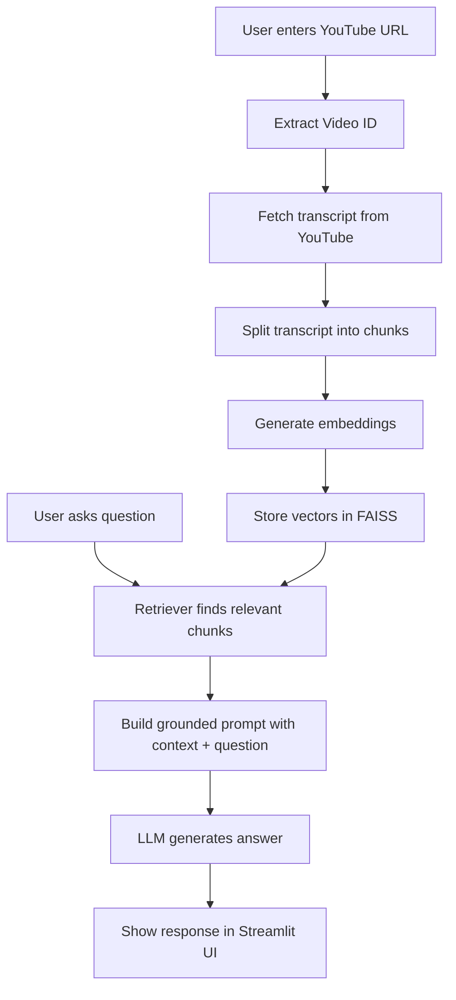

# YouTube Chatbot (RAG) using LangChain

A Retrieval-Augmented Generation (RAG) web app that lets users paste a YouTube URL and ask questions grounded in the video's transcript.

## Features

- Paste a YouTube URL and build a transcript-based knowledge index.
- Uses LangChain + FAISS for retrieval over transcript chunks.
- Answers are generated from retrieved context only.
- Simple Streamlit chat interface with session-level conversation history.
- Supports English and Hindi transcript fetch attempts.

## Tech Stack

- Python
- Streamlit
- LangChain
- OpenAI (`ChatOpenAI`, `OpenAIEmbeddings`)
- FAISS
- YouTube Transcript API

## Project Workflow

1. Extract video ID from YouTube URL.
2. Fetch transcript from YouTube.
3. Split transcript into chunks.
4. Create embeddings and index in FAISS.
5. Retrieve relevant chunks for each user question.
6. Prompt LLM with retrieved context and generate answer.

## Architecture Diagram



## Setup

1. Clone the repository and go to the project directory.
2. Create and activate a virtual environment.
3. Install dependencies:

```bash
pip install -r requirements.txt
```

4. Create a `.env` file in this folder:

```env
OPENAI_API_KEY=your_openai_api_key
```

If you don't have a paid OpenAI API Key, try with Gemini.

## Run the App

```bash
streamlit run web_app.py
```

Then open the local URL shown in terminal (usually `http://localhost:8501`).

## Usage

1. Paste a valid YouTube video URL.
2. Click **Process Video**.
3. Ask questions about the processed video in the question box.

## Notes

- If captions are disabled/unavailable, processing will fail.
- Answers are limited by transcript quality and available context.
- This project is intended for learning and portfolio demonstration.
